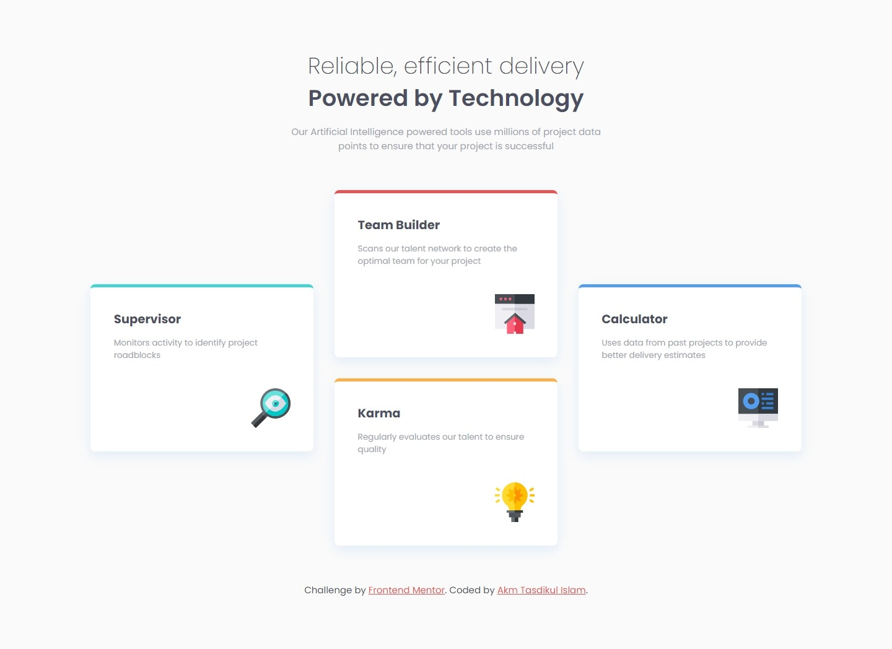
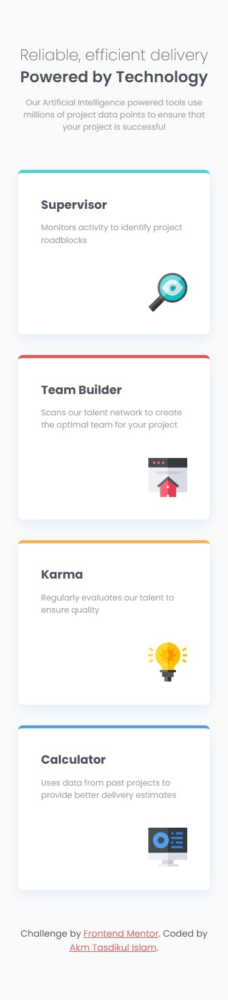

# Frontend Mentor - Four card feature section solution

This is a solution to the [Four card feature section challenge on Frontend Mentor](https://www.frontendmentor.io/challenges/four-card-feature-section-weK1eFYK). Frontend Mentor challenges help you improve your coding skills by building realistic projects.

## Table of contents

- [Overview](#overview)
  - [The challenge](#the-challenge)
  - [Screenshot](#screenshot)
  - [Links](#links)
- [My process](#my-process)
  - [Built with](#built-with)
  - [What I learned](#what-i-learned)
  - [Useful resources](#useful-resources)
- [Author](#author)

## Overview

Project Start Date: 05 March 2024
Project Duration: 1 hour 30 Minutes

### The challenge

Users should be able to:

- View the optimal layout for the site depending on their device's screen size

### Screenshot

| Desktop Version                         | Mobile Version                         |
| --------------------------------------- | -------------------------------------- |
|  |  |

### Links

- [Solution URL:](https://github.com/akmtasdikulislam/four-card-feature-section)
- [Live Site URL:](https://akmtasdikulislam.github.io/four-card-feature-section/)

## My process

- At first, I linked the `style.css` file and the Google CDN with `index.html`.
- Then, imported the colors from `style-guide.md` into the `style.css` file. After that, I initialized the css file and set necessary parameters (such as, font-families, colours, font-sizes, page backgound etc.) for this project.
- Then, I wrote necessary code to reach the given _UI Design Sample_ and also added necessary css styles to match it with the _UI Design Sample_.
- Finally, I wrote the necessary CSS MEDIA QUERIES for mobile device view of this project.

### Built with

- Semantic HTML5 markup
- CSS custom properties
- Flexbox

### What I learned

By doing this project, I learned how to position items in different ways using CSS Flexbox.

### Useful resources

- [93 Beautiful CSS box-shadow examples](https://getcssscan.com/css-box-shadow-examples) - This helped me to add box shadow to the cards.

## Author

- Frontend Mentor - [@akmtasdikulislam](https://www.frontendmentor.io/profile/akmtasdikulislam)
- Twitter - [@Akm_Tasdikul](https://www.twitter.com/Akm_Tasdikul)
